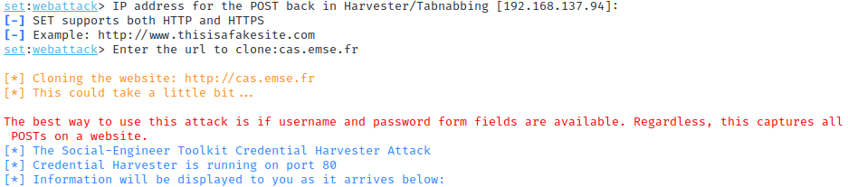
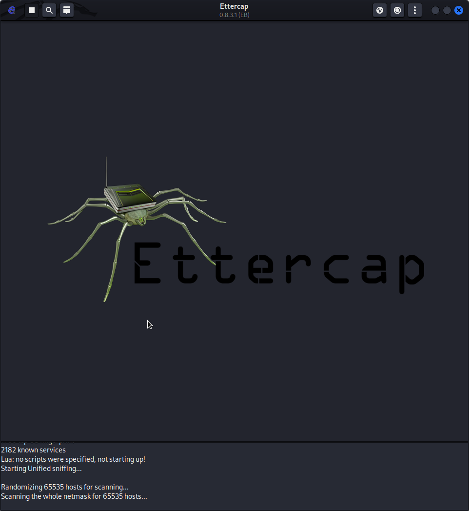

 # Phishing avancé

 Afin de cloner un site web, on peut utiliser les outils natifs de Kali Linux avec l'outil : "social engineering toolkit"

    sudo setoolkit

Dans le menu, on choisit alors
- 1\) Social-Engineering Attacks 
- 2\) Website Attack Vectors
- 3\) Credential Harvester Attack Method
- 2\) Site Cloner

On nous demande ensuite d'entrer l'addresse IP sur laquelle on veut récupérer les requêtes. On peut donc appuyer sur entrée pour laisser notre addresse IP locale.

On veut cloner le site d'authentification de l'école dans le but de récolter les identifiants et les mots de passe des utilisateurs de l'école.

On clone donc le site d'authentification de l'école : https://cas.emse.fr

Désormais, on peut écouter sur le terminal les requêtes, et notamment les identifiants qui arrivent sur notre addresse IP sur le port http.

>Seulement, comment faire pour que les personnes attaquées y accèdent ? 

1. La première solution utilisée la plupart du temps est d'héberger ce clone sur une autre adresse IP publique et de l'utiliser pour enregistrer les données sensibles

2. Dans le cadre d'un réseau privé, nous avons testé une autre solution: Le **DNS Spoofing**

Pour cela, nous avons utilisé un autre outil de Kali Linux : Ettercap

Cette attaque consiste à se mettre entre le routeur et le serveur DNS pour intercepter les requêtes DNS et en filtrer certaines pour les diriger vers les adresses IP voulues (ici notre addresse IP).

On modifie la configuration du logiciel afin de dérouter les connexions de cas.emse.fr vers notre adresse IP :

Pour cela, on modifie le fichier situé dans /etc/ettercap/etter.dns

On ajoute les lignes suivantes :

    cas.emse.fr 		A 	10.163.96.137
    cas.emse.fr/login 	A 	10.163.96.137
    *.emse.fr 		    A 	10.163.96.137
    www.cas.emse.fr 	PTR 	10.163.96.137

