Rapport
Introduction à la cybersécurité
==============

Auteurs: BACKERT Noé, BANCHET Antoine, BARA Yassmina

# Table des matières
1. [Introduction](#introduction)
2. [Footprint](#reconnaissancefootprint)
   -   [Rapport Antoine Banchet (Rogue Wifi ap)](#rapport-phishing-antoine-banchet)
   -   [Rapport Yassmina Bara (zphisher)](#rapport-phishing-yassmina-bara)
   -   [Rapport Noé Backert (DNS Spoofing)](#rapport-phishing-noé-backert)
3. [Scanning Networks](#scanning-networks)
4. [Enumeration](#enumeration)
5. [Gaining Access](#gaining-access)
6. [Conclusion](#conclusion)

# Introduction

Ce rapport est écrit dans le but d'introduction à la sécurité dans le cadre des cours d'ingénieur à l'école des Mines de Saint-Étienne.
On s'intéressera alors au phishing, au scan de réseaux et des ports ouverts sur différentes machines, ainsi qu'aux scans de leurs vulnérabilités.
On s'occupera dans un second temps de proposer des solutions à ces vulnérabilités.
Pour les parties 2, 3 et 4, nous allons utiliser le réseau privé suivant fabriqué à l'aide d'un réseau privé fait par l'ordinateur fixe de Noé.

 
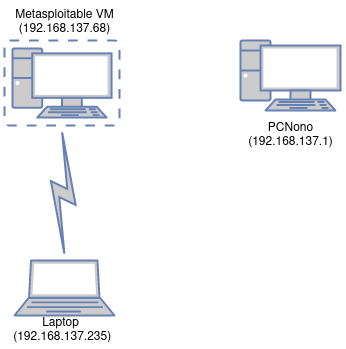

 
 
 
 

# Reconnaissance/Footprint

La première phase d'une attaque est la phase de reconnaissance. Le but est d'obtenir le plus d'informations possible sur notre victime.

On doit toujours déterminer le scope de l'attaque et avoir la permission de l'entreprise ou du particulier avant de commencer.

Que ce soit pour récupérer des informations sur une entreprise ou sur une personne, on peut utiliser dans un premier temps les moteurs de recherche classiques tels que Google, Bing, Yahoo, DuckDuckGo,... On peut utiliser les Google Dorks pour trouver des informations plus précises. 
Le Google Dorking consiste à utiliser des opérateurs de recherche avancés dans les moteurs de recherche pour trouver des informations sensibles et cachées sur des sites web. 
Exploit DB regroupe beaucoup de Google Dorks: https://www.exploit-db.com/google-hacking-database.

Il peut aussi être très intéressant de visiter des sites web archivés avec archive.org ou waybackmachine.org. Ces sites permettent de voir les anciennes versions d'un site web afin de récupérer des informations qui ont été supprimées.

Des outils GitHub tels que [Holehe](https://github.com/megadose/holehe/) ou [Sherlock](https://github.com/sherlock-project/sherlock) permettent de rechercher des pseudos sur les réseaux sociaux. Ils permettent de trouver des informations sur une personne en recherchant son pseudo sur les réseaux sociaux.

- Sherlock permet de rechercher un pseudo sur des centaines de réseaux sociaux.

- Holehe est un outil qui permet de vérifier si une adresse e-mail est associée à un compte sur différents sites tels que Twitter, Instagram, Imgur et plus de 120 autres plateformes. Cet outil est implémenté dans notre framework.

Les sites web contiennent aussi des documents très intéressants (PDF, Excel, etc.) qui peuvent être intéressants à récupérer avec Metagoofil. Metagoofil est un outil qui permet de récupérer des informations sur un site web (par exemple : les adresses e-mail des personnes qui ont travaillé sur le site, les documents PDF, les images, ...) et de les télécharger.

Ensuite, il faut recueillir des informations plus techniques. On s'intéresse au nom de domaine avec l'outil WHOIS qui permet d'obtenir beaucoup d'informations sur celui-ci.
De même, TheHarvester va aller chercher les sous-domaines d'un site web, les adresses e-mails liées à celui-ci, etc.
WHOIS et TheHarvester sont implémentés dans notre framework.

On peut aussi utiliser traceroute pour voir le chemin d'un paquet vers le domaine entré.

    traceroute raphaelviera.fr

traceroute - affiche le chemin d'un paquet vers le domaine entré

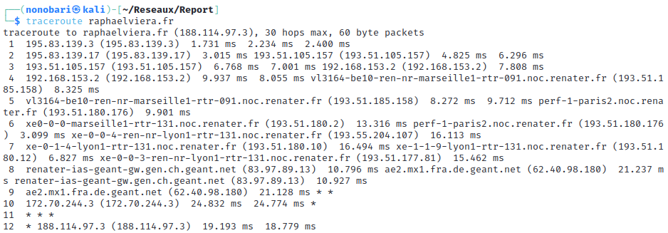

Le but est vraiment d'obtenir le plus d'informations possible et de comprendre la structure du site web à attaquer ou de l'entreprise ou de la cible.
Il s'agit ensuite de réaliser du social engineering très ciblé grâce aux informations récoltées.

Le social engineering est une technique qui consiste à manipuler les gens pour qu'ils donnent des informations sensibles ou qu'ils effectuent des actions qui peuvent être préjudiciables pour eux ou pour leur entreprise.
On peut se faire passer pour un membre de l'entreprise, réussir à rentrer dans l'entreprise et récupérer des informations sensibles, ou encore se faire passer pour un membre de la famille de la cible et récupérer des informations sensibles. Il existe de nombreuses techniques de social engineering. 
Il faut retenir que plus on connaît la cible, plus on est susceptible de réussir.

# Rapport phishing Antoine Banchet

## Introduction

Cette section est individuelle et a pour but de présenter le phishing et ses différentes formes.

La cible durant cette section est Noé Backert, dont j'ai obtenu son autorisation préalable.

#### a. Cas pratique

Le cas pratique le plus courant consiste à créer un mail de phishing. Pour cela, on peut utiliser des outils tels que [GoPhish](https://getgophish.com/), qui permettent de créer des mails de phishing et de suivre les personnes qui ont cliqué sur le lien ou ouvert la pièce jointe. Cet outil est principalement utilisé pour mener des campagnes de phishing. On peut également utiliser Social Engineering Toolkit (SET) pour cibler une personne spécifique. Cet outil permet de créer directement un mail de phishing et de l'envoyer à la cible. Il est également possible de cloner directement un site.

Cependant, j'ai décidé d'utiliser une technique appelée "Rogue Wi-Fi Access Point Attack" en utilisant le framework "Wifipumpkin3". Ce framework permet de créer un point d'accès Wi-Fi et de cloner un site. Ainsi, lorsque la cible se connecte au point d'accès, elle est redirigée vers le site cloné. On peut alors récupérer les identifiants de la cible. Vous pouvez trouver le framework "Wifipumpkin3" sur GitHub à l'adresse suivante : [https://github.com/P0cL4bs/wifipumpkin3](https://github.com/P0cL4bs/wifipumpkin3).

 
 
 

#### b. Explication de la méthode utilisée

Sur le réseau de notre résidence étudiante, après s'être connecté au réseau Wi-Fi, nous devons nous identifier avec nos identifiants étudiants pour pouvoir accéder à Internet. Ainsi, j'ai décidé de créer un point d'accès Wi-Fi avec le même nom que le réseau Wi-Fi de la résidence étudiante et de cloner la page de connexion. Ainsi, lorsque la cible se connecte au point d'accès, elle est redirigée vers la page de connexion clonée.

Pour cela, j'ai utilisé le framework "Wifipumpkin3". Ce framework permet de créer un point d'accès Wi-Fi et de cloner un site.

Voici la page de connexion du réseau Wi-Fi de la résidence étudiante :
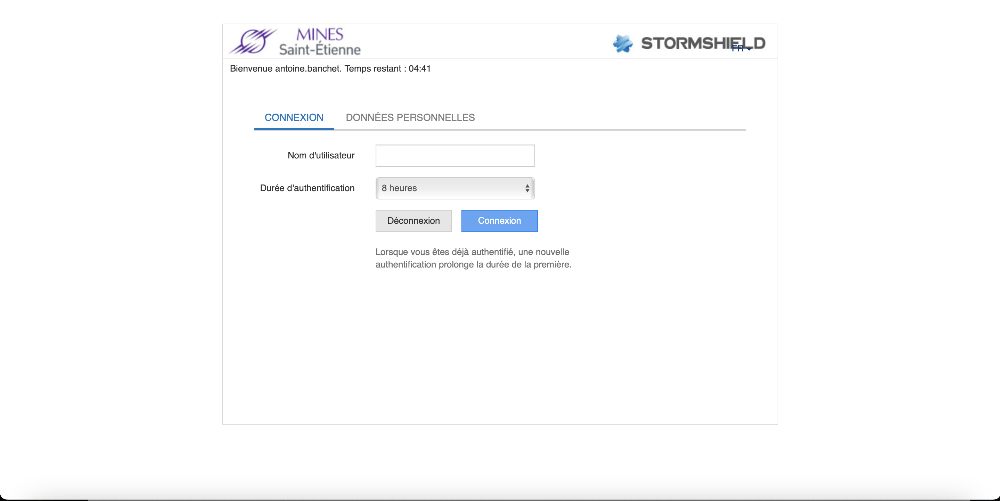

1. Le framework wifipumpkit3 ressemble à cela :
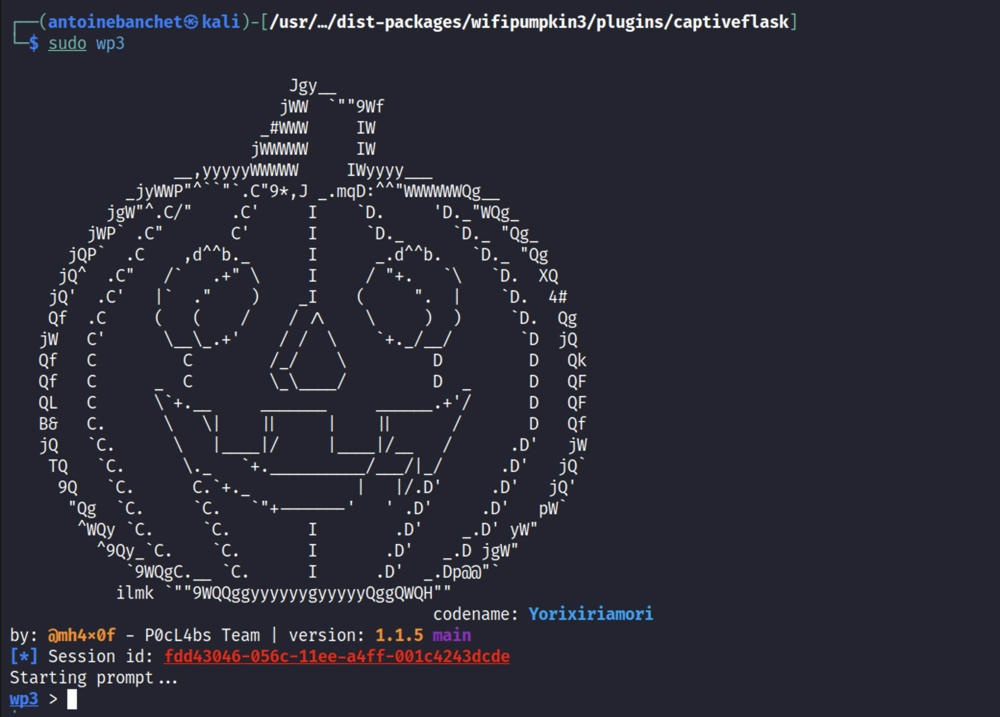

2. Il faut dans un premier temps configurer le point d'accès Wi-Fi (AP) :
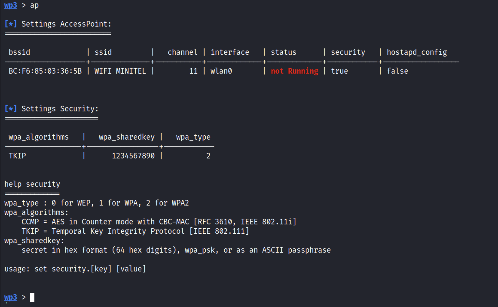
 
On voit que l'AP est configuré avec le nom du réseau Wi-Fi de la résidence étudiante, et que le mode de sécurité est WPA2. J'aurais aussi pu mettre le même mot de passe, mais je dois hacker uniquement Noé et pas toute la résidence 😅.

3. Ensuite, il faut configurer le module de clonage de site (web-cloner). J'ai utilisé pour cela goclone : [https://github.com/imthaghost/goclone](https://github.com/imthaghost/goclone).
4. On active ensuite le portail de connexion sur Wifipumpkin3, ce qui active la page de connexion de la résidence étudiante, ici "emse_v2".
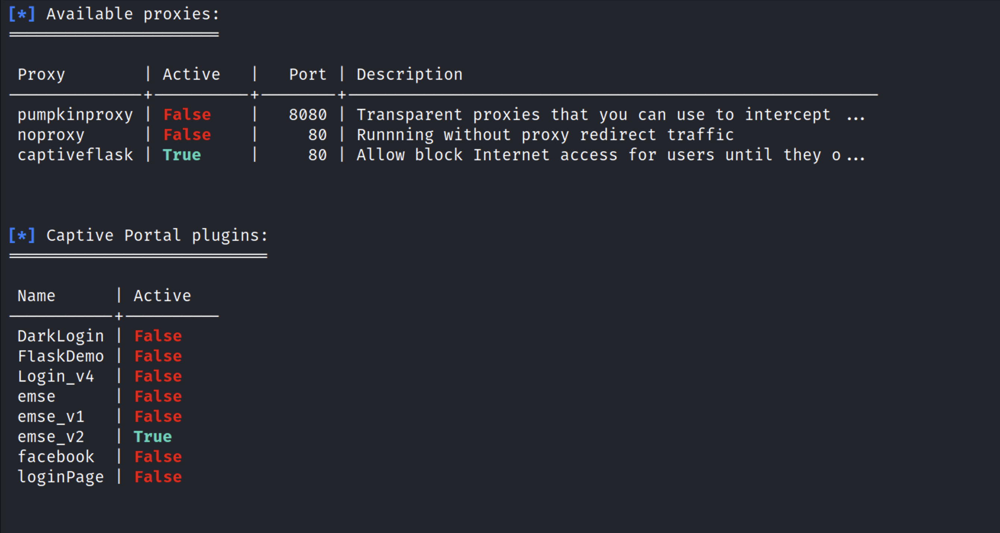
J'ai suivi le tutoriel suivant pour réaliser cette étape : [https://wifipumpkin3.github.io/docs/getting-started#development](https://wifipumpkin3.github.io/docs/getting-started#development).

5. Enfin, on lance le point d'accès Wi-Fi et on attend que la cible se connecte.
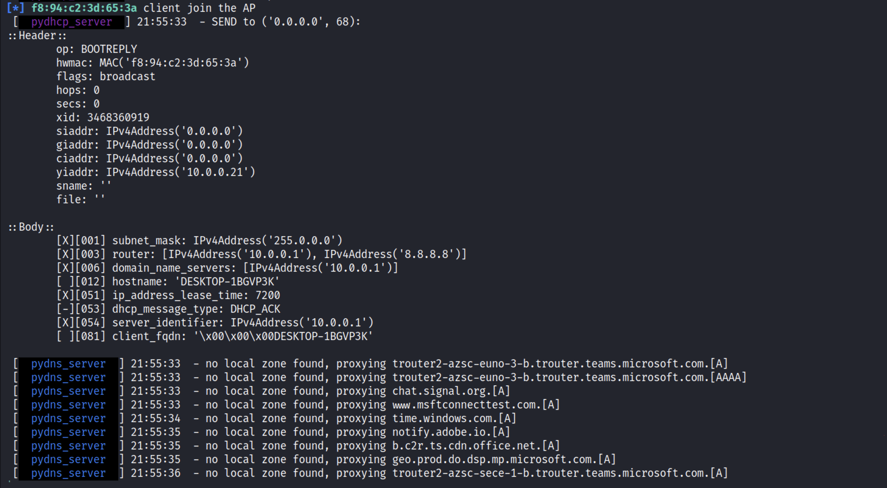
 
On voit l'adresse MAC de la cible connectée au point d'accès Wi-Fi, ici Noé. Un serveur DHCP et DNS est également lancé, permettant de rediriger la cible vers la page de connexion clonée. On voit que l'ordinateur de Noé est nommé "DESKTOP-1BGVP3K".

6. Lorsque la cible se connecte, elle est redirigée vers la page de connexion clonée. On peut alors récupérer les identifiants de la cible. Dans cet exemple, les identifiants de Noé sont "noe.backert" et le mot de passe est "test".
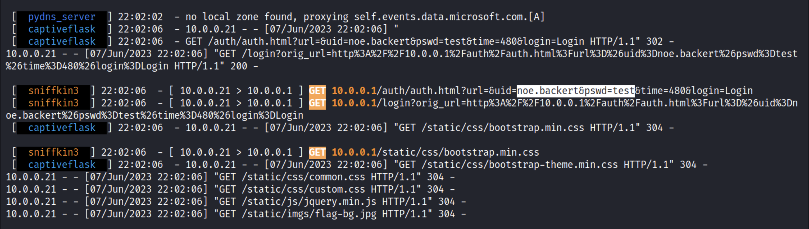

Remarque :
Il est possible de déconnecter de manière répétée les utilisateurs du réseau Wi-Fi en envoyant en boucle des paquets de déauthentification, ce qui rendrait la connexion au vrai Wi-Fi impossible. Cela forcerait ainsi les utilisateurs à se connecter au faux Wi-Fi. Wifipumpkin3 permet de réaliser cette action.

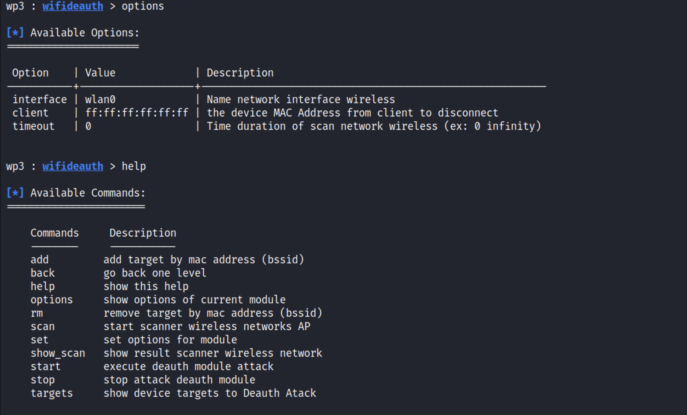
On peut utiliser aireplay-ng pour le faire aussi:
https://www.inkyvoxel.com/wi-fi-deauthentication-attacks-using-aireplay-ng/

#### c. Du point de vue de la victime

1. Noé se connecte au réseau Wi-Fi de la résidence étudiante.
2. Il constate que le réseau est bien celui de la résidence étudiante et qu'il est sécurisé. Il décide donc de s'y connecter.
 
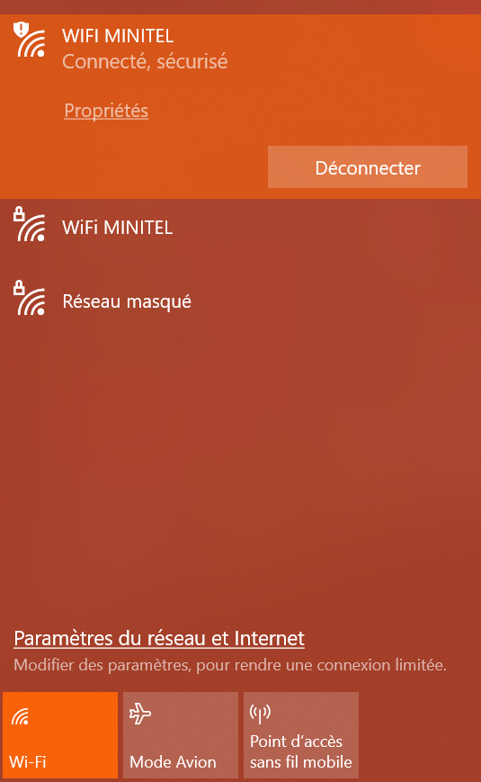
3. Il est redirigé vers une page de connexion qui semble être celle de la résidence étudiante. Noé entre alors ses identifiants.
 
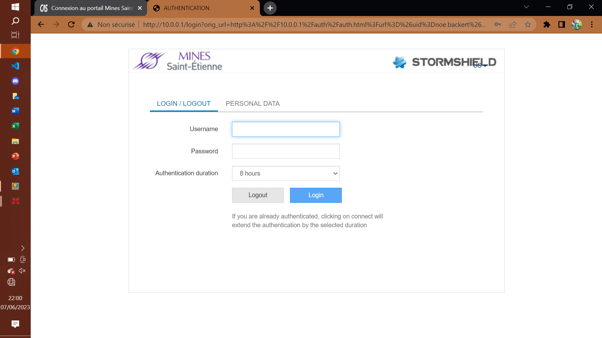
4. Par la suite, il navigue sur Internet normalement sans se rendre compte de rien. Cependant, l'attaquant a maintenant accès à toutes les informations qu'il consulte et qui sont visibles en clair.

#### d. Conclusion
En conclusion, cette attaque n'est pas encore parfaite, car l'URL de la fausse page de connexion affiche l'adresse IP du routeur (10.0.0.1), et non l'adresse de la page de connexion réelle de la résidence étudiante. Il faudrait donc trouver un moyen de changer l'URL de la page de connexion. Une possibilité pourrait être de configurer le DNS du point d'accès pour parvenir à ce résultat.

Cette attaque est simple à mettre en place et peut s'avérer très efficace. Il est donc crucial de faire preuve de vigilance lors de la connexion à des réseaux Wi-Fi, notamment les réseaux publics, et de vérifier que l'adresse de la page de connexion correspond bien à celle du site officiel.

# Rapport phishing Yassmina Bara

## Introduction
Partie Social engineering 
Le social engineering, ou ingénierie sociale, est une technique utilisée pour manipuler psychologiquement les individus afin d'obtenir des informations confidentielles ou de les amener à effectuer des actions spécifiques. Cette méthode exploite les faiblesses humaines, telles que la confiance, la curiosité, la peur ou l'ignorance, pour tromper les personnes ciblées. 
Concernant ce TP, on utilise la technique du phishing. Il s'agit d'envoyer des e-mails ou des messages prétendant provenir d'une source fiable, telle qu'une institution financière ou une entreprise connue, afin de tromper les destinataires et de les inciter à divulguer des informations sensibles, telles que des mots de passe ou des numéros de carte de crédit. Pour réaliser ce TP, nous avons utilisé le framework ZPhisher et l'outil intitulé Maigret.

1. **ZPhisher** : ZPhisher est un framework de phishing automatisé basé sur le langage de programmation Python. Il offre une gamme d'outils et de modèles préconfigurés pour mener des attaques de phishing. Il permet aux utilisateurs de créer des pages de phishing imitant différents sites web populaires, tels que les réseaux sociaux, les services de messagerie, les sites bancaires, etc. ZPhisher facilite la génération de liens malveillants et la capture d'informations confidentielles des victimes.

2. **Maigret** : Maigret est un outil open source basé sur Python qui permet de collecter des informations sur une personne à partir de diverses sources en ligne. Il recherche les profils de médias sociaux, les adresses e-mail, les noms d'utilisateur et d'autres informations liées à une personne spécifique. Bien que Maigret puisse être utilisé pour recueillir des informations, il est important de souligner que l'utilisation abusive de ces données peut porter atteinte à la vie privée des individus.

Nous avons installé les deux outils et exécuté les deux commandes suivantes :

    `$ cd zphisher`

    `$ bash zphisher.sh`

On obtient les figures suivantes : on demande de sélectionner le site auquel appliquer le phishing, on choisit par exemple Instagram, on sélectionne le numéro correspondant au site voulu, on choisit le type du login, ceci afin de générer le lien menant à la page où la cible entrera les informations de son compte Instagram. Les figures suivantes illustrent les différentes étapes pour générer le lien à envoyer à la cible.

 
Voici un exemple de mail envoyé à la cible, il contient le lien généré:

> Nous avons constaté une opération suspecte concernant votre compte Instagram, afin de renforcer la sécurité de votre compte, vous devez vous connectez au lien ci-dessous affin d’améliorer les paramètres de sécurité: https://is_get/SudDFzj

                              

# Rapport phishing Noé Backert

Afin de cloner un site web, on peut utiliser les outils natifs de Kali Linux avec l'outil : "social engineering toolkit"

    sudo setoolkit

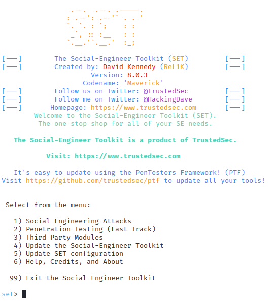

Dans le menu, on choisit alors
- 1\) Social-Engineering Attacks 
- 2\) Website Attack Vectors
- 3\) Credential Harvester Attack Method
- 2\) Site Cloner

On nous demande ensuite d'entrer l'addresse IP sur laquelle on veut récupérer les requêtes. On peut donc appuyer sur entrée pour laisser notre addresse IP locale.

On veut cloner le site d'authentification de l'école dans le but de récolter les identifiants et les mots de passe des utilisateurs de l'école.

On clone donc le site d'authentification de l'école : https://cas.emse.fr

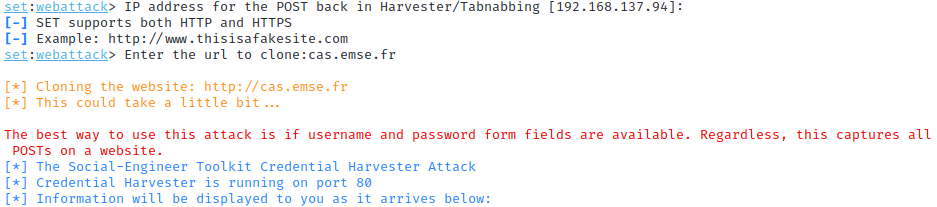

Désormais, on peut écouter sur le terminal les requêtes, et notamment les identifiants qui arrivent sur notre addresse IP sur le port http.

>Seulement, comment faire pour que les personnes attaquées y accèdent ? 

1. La première solution utilisée la plupart du temps est d'héberger ce clone sur une autre adresse IP publique et de l'utiliser pour enregistrer les données sensibles

2. Dans le cadre d'un réseau privé, nous avons testé une autre solution: Le **DNS Spoofing**

Pour cela, nous avons utilisé un autre outil de Kali Linux : Ettercap

Cette attaque consiste à se mettre entre le routeur et le serveur DNS pour intercepter les requêtes DNS et en filtrer certaines pour les diriger vers les adresses IP voulues (ici notre addresse IP).

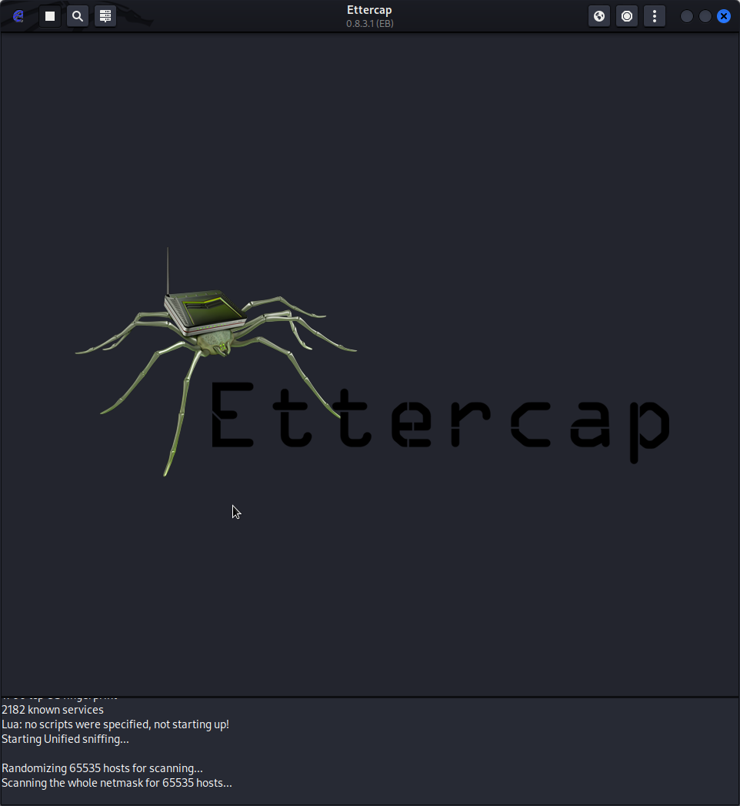

On modifie la configuration du logiciel afin de dérouter les connexions de cas.emse.fr vers notre adresse IP :

Pour cela, on modifie le fichier situé dans /etc/ettercap/etter.dns

On ajoute les lignes suivantes :

    cas.emse.fr 		A 	10.163.96.137
    cas.emse.fr/login 	A 	10.163.96.137
    *.emse.fr 		    A 	10.163.96.137
    www.cas.emse.fr 	PTR 	10.163.96.137

Cette manière n'a pas fonctionné pour les requêtes https, mais cette attaque est très efficace pour les requêtes http qui ne sont pas chiffrées.

## 2. Countermeasures against phishing
Pour se protéger du phishing, il est recommandé de faire preuve de prudence et de vigilance. Il est important d'être conscient des risques liés aux communications non sollicitées, telles que les emails, les messages ou les appels téléphoniques, qui peuvent chercher à obtenir des informations personnelles ou financières. Il est conseillé de vérifier attentivement l'identité de l'expéditeur en confirmant l'adresse email ou le numéro de téléphone utilisé. Il est également préférable de ne pas cliquer sur des liens suspects, qui peuvent potentiellement rediriger vers des sites web frauduleux. Pour assurer une protection adéquate, il est recommandé de ne partager des informations sensibles que lorsque l'on est certain de la légitimité de la demande. L'activation de l'authentification à deux facteurs lorsqu'elle est disponible et la mise à jour régulière des logiciels utilisés sont des mesures supplémentaires pour renforcer la sécurité en ligne. Enfin, il est bénéfique de se familiariser avec les différentes techniques de phishing afin d'être mieux préparé à les reconnaître et de partager ces connaissances avec d'autres pour les sensibiliser à ces risques potentiels.

# Scanning networks
## 1. Network scan
Le "network scan" consiste à explorer et à analyser les hôtes, les ports ouverts et les services disponibles sur le réseau afin d'identifier d'éventuelles vulnérabilités et faiblesses de sécurité.

L'objectif principal du "network scan" est de cartographier le réseau, c'est-à-dire de découvrir les hôtes actifs, d'identifier les systèmes, les adresses IP et les services accessibles depuis l'extérieur. Cela nous permet d'évaluer la surface d'attaque potentielle et de cibler nos efforts sur les zones les plus sensibles.

En effectuant un "network scan", nous pouvons détecter les ports ouverts, les services mal configurés, les versions de logiciels obsolètes et les éventuelles vulnérabilités connues. Ces informations sont ensuite utilisées pour planifier et exécuter des tests de sécurité plus approfondis, tels que des scans de vulnérabilités ou des attaques ciblées.

<u>Méthodologie</u>
Pour effectuer un scan basique d'un réseau, on peut utiliser la commande suivante : 

    fping -s -g 192.168.137.0 192.168.137.254

Celle-ci nous permet d'envoyer une requête et d'attendre une réponse pour l'ensemble des adresses IP du sous-réseau indiqué (ici 192.168.137/24).

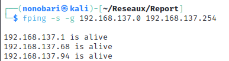
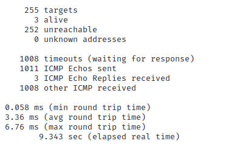

Ainsi, nous savons que 3 appareils sont connectés au réseau.

On peut donc augmenter la taille des paquets jusqu'à obtenir une erreur de timeout en utilisant la commande suivante :

    ping -s <packet_size> 192.168.137.68

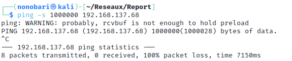

En tâtonnant, on observe qu'il y a une erreur en envoyant un paquet au dessus de 65507 bytes. Le buffer ne doit pas accepter autant. 

Autrement, on peut vérifier cela à l'aide du script python suivant :

    import os
    import sys

    if len(sys.argv)<=1:
        print("Error : Arg missing, ip required")
    else: 
        ip = sys.argv[1]
        for size in range(0,80000,8):
            os.system(f"ping -s {size} -c 1 {ip}")

Celui-ci teste un ping vers l'adresse ip mis en argument lors du lancement du script en augmantant à chaque fois d'un octet, jusqu'à qu'une erreur intervienne.

On obtient alors bien une erreur vers la taille trouvée en tâtonnant :

>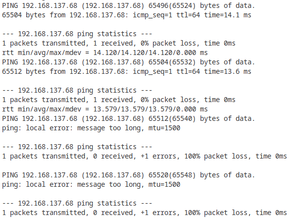

Autrement, on peut tout simplement effectuer un nmap sur l'ensemble du sous-réseau :

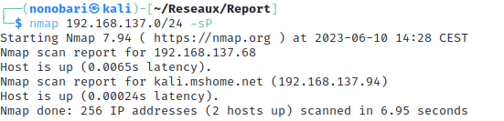

La commande suivante nous permet d'envoyer une requête de ping à toutes les addresses IP du réseau (en utilisant le masque de sous-réseau 255.255.255.0)

    nmap 192.168.137.0/24 -sP

Cela nous permet ainsi de voir quels addresses IP sont utilisées, cependant, on ne peut pas deviner l'identité de cette machine en utilisant seulement cette commande.

---

Pour faire cela nous utilisons principalement nmap ce qui est la norme. 
On peut aussi utiliser des outils plus automatisés comme netdiscover ou encore graphique comme nessus.

## 2. Port scan

Le "port scan" consiste à analyser les ports d'un hôte ou d'un réseau pour déterminer quels ports sont ouverts, fermés ou filtrés.

Chaque service réseau s'exécute généralement sur un port spécifique, par exemple, le service Web HTTP sur le port 80 ou le service de messagerie SMTP sur le port 25. En effectuant un "port scan", nous pouvons identifier les services qui sont accessibles depuis l'extérieur et les ports ouverts sur lesquels ces services s'exécutent.

Le "port scan" peut être utilisé pour différentes raisons. Tout d'abord, il permet de cartographier les ports ouverts sur un système, ce qui donne une idée de la surface d'attaque potentielle et permet de détecter d'éventuelles vulnérabilités ou faiblesses de configuration. En identifiant les services actifs et les versions logicielles, nous pouvons rechercher des vulnérabilités connues associées à ces services et prendre des mesures pour les corriger.

De plus, le "port scan" peut être utilisé pour évaluer les politiques de filtrage des pare-feu. En analysant les réponses des ports, les testeurs peuvent déterminer quels ports sont bloqués ou filtrés, ce qui permet de mieux comprendre la défense en place et de détecter d'éventuelles erreurs de configuration.

Pour cela, nous utilisons principalement nmap qui est la norme.

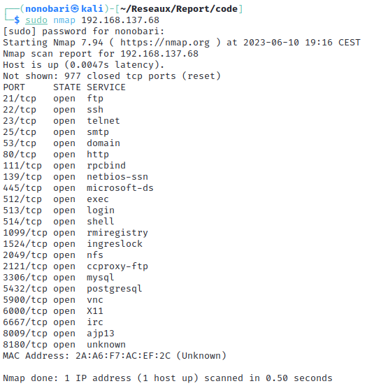

Cette commande nous permet de trouver tous les ports ouverts et également d'obtenir des informations supplémentaires sur la machine, telles que son adresse MAC.

    sudo nmap 192.168.137.68

Cette commande requiert l'accès root.

## 3. Vulnerability scan

La phase de scan de vulnérabilité est une étape cruciale car elle permet d'identifier les vulnérabilités potentielles présentes dans les systèmes, les applications ou les infrastructures testées. Cela implique l'utilisation d'outils et de techniques spécifiques pour analyser et évaluer la sécurité des cibles.

Durant le cours, nous utilisons une machine virtuelle VISMIN qui présente des failles de sécurité.

Il faut suivre les étapes suivantes :

1. Identification des vulnérabilités : Le scan de vulnérabilité permet de découvrir les faiblesses de sécurité potentielles dans les systèmes ciblés.

2. Priorisation des actions : Le scan de vulnérabilité fournit des informations quantitatives et qualitatives sur les vulnérabilités détectées. Cela permet de classer les vulnérabilités en fonction de leur criticité et de leur impact potentiel sur la sécurité.

3. Conformité aux normes : Le scan de vulnérabilité peut aider les organisations à se conformer à des normes et des réglementations de sécurité spécifiques. Il faut pour chaque vulnérabilité se référer à sa catégorie OWASP.

OWASP (Open Web Application Security Project) est une communauté mondiale dédiée à l'amélioration de la sécurité des applications web.

4. Sensibilisation à la sécurité : La phase de scan de vulnérabilité permet de sensibiliser les parties prenantes.

<u>Méthodologie</u>

Pour réaliser un scan de vulnérabilité :

1. Il faut trouver l'IP de la machine à scanner, voir [Network Scan](## 1. Network scan).

2. Ensuite, il faut lister les ports avec nmap, voir [Port Scan](## 2. Port scan).

3. Ensuite, on peut soit chercher des vulnérabilités à la main ou avec des scripts nmap, par exemple. Cependant, utiliser des outils automatisés tels que Nessus ou OpenVAS facilite beaucoup la tâche.

## 4. Patching the Vulnerabily

Lorsqu'on découvre des vulnérabilités lors de la phase de scan de vulnérabilité, il est essentiel de suivre un processus structuré pour leur gestion :

1. Documentation : Les vulnérabilités doivent être soigneusement documentées, en fournissant des détails précis tels que la description, l'emplacement, l'impact potentiel et les preuves de l'existence de la vulnérabilité. 
   
2. Évaluation de l'impact : Il est important d'évaluer l'impact réel des vulnérabilités identifiées. 

3. Priorisation : Les vulnérabilités doivent être classées en fonction de leur criticité, de leur exploitabilité et de leur impact potentiel. 
   
4. Recommandations de correction : Il faut fournir des recommandations claires et précises pour corriger les vulnérabilités identifiées. 

5. Rapport : Les résultats de l'analyse des vulnérabilités doivent être communiqués aux parties prenantes concernées, généralement sous forme de rapport détaillé.

6. Suivi et vérification : Une fois les vulnérabilités corrigées, il est important de vérifier leur résolution effective. 

   

# Enumeration
En plus de simplement rechercher les vulnérabilités d'une machine, on peut chercher à les exploiter.
Pour cela, nous devons obtenir des informations sur les services de la machine.
On va mettre en place du "Banner Grabbing", qui consiste à extraire les bannières de services réseau pour obtenir des informations sur les versions logicielles et les configurations. Mais aussi de l'énumération d'OS (système d'exploitation) pour déterminer le système d'exploitation utilisé par la cible, ce qui peut aider à identifier les vulnérabilités spécifiques à ce système. L'énumération des utilisateurs implique la recherche d'informations sur les utilisateurs valides du système, tels que les noms d'utilisateur, les comptes actifs, les groupes d'utilisateurs, etc. 
Dans l'ensemble, la phase d'énumération permet d'obtenir des informations précieuses sur la cible, ce qui facilite l'élaboration de stratégies d'attaque plus ciblées et aide à identifier les faiblesses potentielles à exploiter.

## 1. Banner Grabbing

On va chercher à extraitre les bannières des services de la machine.

Le banning grabbing permet de récupérer des informations sur les versions logicielles et les configurations des services réseau. Cela peut être fait manuellement en utilisant des outils tels que telnet ou netcat, ou en utilisant des outils automatisés tels que nmap ou metasploit.
Le but est d'obtenir le plus d'information possible sur les services de la machine. Afin de rechercher les failles possibles OWASP.

On peut utiliser <b>telnet</b>. En effet Cela implique de se connecter au service Telnet du système cible et de lire le "banner" ou la bannière d'accueil, qui est généralement un message d'identification ou d'information envoyé par le serveur.
On peut utiliser la commande suivante pour se connecter à un service Telnet :

    telnet <ip_address> <port>
On utilise le plus souvent le port 23.

On peut aussi utiliser <b>netcat</b>:

    nc <ip_address> 80
On utilise le port 80 pour aller chercher les informations sur les ports web HTTP. On peut aussi chercher des bannières sur des services FTP.

<b>Nmap</b> est souvent utilisé pour trouver la version et l'OS de la machine avec des commandes de bases:
    
    nmap -O <adresse_ip>
On peut aussi utiliser des scripts nmap plus complets déjà installés:
    
    nmap -sV -script=banner <adresse_ip>

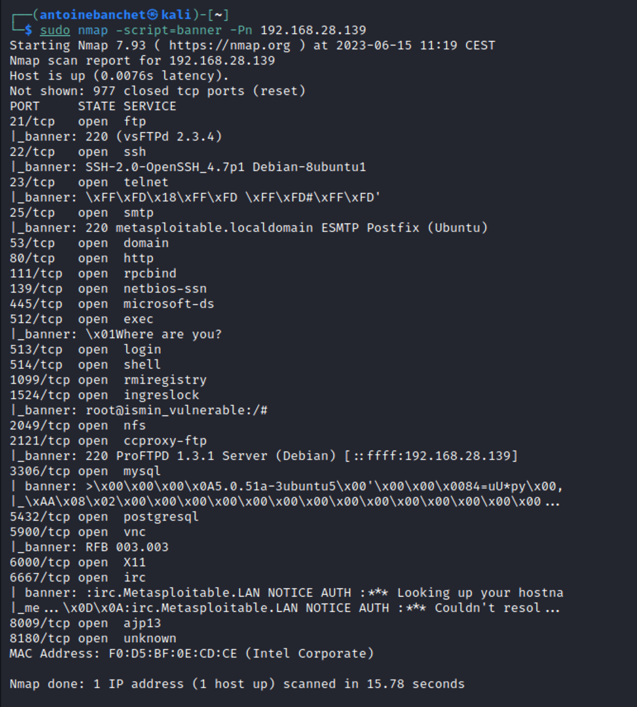
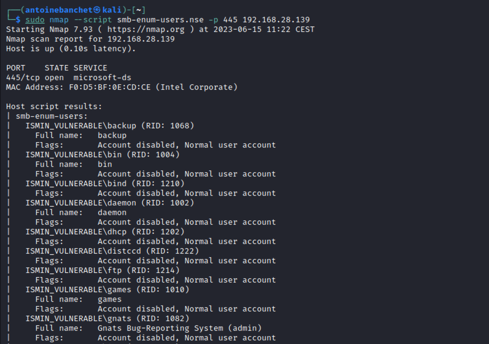

<b>Metasploit</b> contient l'ensemble des fonctionnalités citées précedemment. On peut utiliser la commande suivante pour scanner un service Telnet avec la commande suivante :

    use auxiliary/scanner/telnet/telnet_version
ou encore: 
    
        use auxiliary/scanner/http/http_version

## 2. OS Enumeration

Nmap possède une fonctionnalité bien connue : la détection à distance de l'OS en utilisant l'empreinte du stack TCP/IP. Il envoie une série de paquets TCP et UDP à l'hôte distant, analyse les réponses bit par bit et les compare à sa base de données nmap-os-db, qui contient plus de 2600 empreintes d'OS connues. Si une correspondance est trouvée, Nmap affiche les détails de l'OS, tels que le fabricant (par exemple, Sun), le système d'exploitation (par exemple, Solaris), la génération de l'OS (par exemple, 10) et le type de dispositif (usage général, routeur, commutateur, console de jeu, etc.). Les empreintes incluent également une représentation Common Platform Enumeration (CPE) comme cpe:/o:linux:linux_kernel:2.6.

    nmap -O <adresse_ip>
## 3. User Enumeration

L'énumération des utilisateurs est une étape essentielle dans tout test de pénétration. Elle permet au testeur de découvrir quels utilisateurs ont accès au serveur et quels utilisateurs sont présents sur le réseau. L'énumération des utilisateurs est également utilisée pour tenter d'accéder à la machine en utilisant des techniques de force brute. Une fois que le testeur connaît le nom d'utilisateur, il ne reste plus qu'à essayer de deviner le mot de passe par force brute.

On peut faire de l'énumération avec <b>Enum4linux</b>.
    
    enum4linux -a <adresse_ip>
Aussi avec <b>Nmap</b>:

    sudo nmap –script smb-enum-users.nse –p 445 <adresse_ip>
Samba Server est un logiciel open source qui permet de partager des fichiers, des imprimantes et d'autres ressources entre des ordinateurs fonctionnant sous différents systèmes d'exploitation, tels que Windows, Linux et macOS, dans un réseau local. Il implémente le protocole SMB/CIFS (Server Message Block/Common Internet File System), qui est le protocole de partage de fichiers standard utilisé par les systèmes Windows.

# Gaining Access

## 1. Exploiting FTP
Le protocole de transfert de fichiers (FTP), est un protocole réseau qui permet de transférer ou de manipuler des fichiers sur un réseau informatique.

Le FTP est utilisé pour faciliter l'échange de fichiers entre un client et un serveur. Il permet au client d'envoyer des fichiers vers le serveur ou de les récupérer à partir de celui-ci. Le protocole FTP offre également des fonctionnalités permettant de créer, supprimer, renommer et déplacer des fichiers et des répertoires.

FTP est un protocole non sécurisé, ce qui signifie que les données, y compris les identifiants de connexion et les fichiers transférés, sont transmis en clair sur le réseau. Pour des raisons de sécurité, il est recommandé d'utiliser des protocoles de transfert de fichiers sécurisés, tels que SFTP (SSH File Transfer Protocol) ou FTPS (FTP sécurisé), qui utilisent des méthodes de chiffrement pour protéger les données transitant sur le réseau.

Dans notre exemple de cours, la machine exploitable VISMIN possède <u>une backdoor</u>.

En effet, en se connectant avec telnet au port 21 avec un user finissant par un smiley, cela ouvre le port 6200.

On peut ensuite se connecter avec telnet au port 6200 et obtenir un shell en étant root.

On peut aussi utiliser metasploit pour exploiter cette faille.

On peut aussi tout simplement <u>brutforcer</u> avec <b>Hydra</b> le mot de passe de l'utilisateur ftp.
On utilise un dictionnaire de mots de passes et un dictionnaire de users.
On obtient :

USER = user

PASS = user

## 2. Exploiting SSH

Pour exploiter le SSH on peut aussi utiliser Hydra. 

    hydra -L /home/kali/FTP_hack/usernames.txt -P /home/kali/FTP_hack/passwords.txt <IP_VISMIN> ssh -V

On peut aussi utiliser metasploit en utilisant le module ssh_login.

    use auxiliary/scanner/ssh/ssh_login

## 3. Netbios-SSN (port 139)
Le Network Basic Input/Output System (NetBIOS) fournit des services liés à la couche de session du modèle OSI, permettant aux applications sur des ordinateurs distincts de communiquer via un réseau local.

NetBIOS facilite la communication entre les ordinateurs au sein d'un réseau en fournissant des fonctionnalités telles que l'identification des noms d'ordinateurs, la résolution des noms d'hôtes en adresses IP, la gestion des sessions et la transmission de données entre les applications.

## 4. Java-RMI (port 1099)

Le RMI (Remote Method Invocation) est une API qui fournit un mécanisme pour créer des applications distribuées en Java. Le RMI permet à un objet d'appeler des méthodes sur un objet s'exécutant dans une autre machine virtuelle Java (JVM).

## 5. BINDSHELL (port 1524)

Une "bind shell" est un type de shell dans lequel la machine cible ouvre un port de communication ou un écouteur sur la machine victime et attend une connexion entrante. L'attaquant se connecte ensuite à l'écouteur de la machine victime, ce qui permet l'exécution de code ou de commandes sur le serveur.

Une "bind shell" permet à un attaquant d'établir un accès distant à un système compromis en ouvrant un port d'écoute sur la machine victime. Lorsque l'attaquant se connecte à ce port, il obtient un shell avec des privilèges d'exécution sur le serveur compromis. Cela lui permet d'exécuter des commandes, de télécharger ou de charger des fichiers malveillants, d'explorer le système et d'effectuer diverses activités malveillantes.

  

## 6. PostgreSQL (port 5432)
PostgreSQL est un système de gestion de base de données relationnelle avancé, de classe entreprise et open-source. PostgreSQL prend en charge à la fois les requêtes SQL (relationnelles) et JSON (non relationnelles). PostgreSQL est utilisé comme base de données principale pour de nombreuses applications web, ainsi que des applications mobiles et d'analyse.

## 7. TOMCAT (port 8180)
Apache Tomcat (ou simplement Tomcat) est un serveur web et un conteneur de servlet open source développé par la fondation Apache Software Foundation (ASF). Tomcat implémente les spécifications Java Servlet et JavaServer Pages (JSP) d'Oracle, et fournit un environnement de serveur web HTTP "pure Java" pour exécuter du code Java. Dans la configuration la plus simple, Tomcat s'exécute dans un seul processus du système d'exploitation. Ce processus exécute une machine virtuelle Java (JVM). Chaque requête HTTP individuelle provenant d'un navigateur vers Tomcat est traitée dans le processus Tomcat dans un thread séparé.

## 8. rlogin

Le rlogin (remote login) est un protocole réseau qui permet à un utilisateur distant d'accéder à un ordinateur sur un réseau et d'interagir avec celui-ci comme s'il était directement connecté à l'ordinateur local. Le rlogin est utilisé pour établir une connexion distante entre deux systèmes Unix, généralement sur un réseau local.

C'est la première faille que nous avons trouvé et notre préférée car elle permet une connexion parfaite en root à la machine.

On peut par la suite depuis n'importe quelle machine envoyer des fichers en FTP sur VISMIN.

# Conclusion

Ce rapport détails les différentes étapes d'un pentest. Il est important de noter que chaque pentest est différent et que les étapes peuvent varier en fonction des objectifs et des exigences spécifiques du projet. Cependant, la méthodologie générale reste la même et comprend les étapes suivantes :

1. Reconnaissance : Cette phase consiste à recueillir des informations sur la cible, y compris les adresses IP, les noms de domaine, les informations WHOIS, les enregistrements DNS, les sous-domaines, les adresses e-mail, les numéros de téléphone, etc. Ces informations peuvent être obtenues à partir de sources publiques, telles que les moteurs de recherche, les réseaux sociaux, les sites web, les bases de données publiques, etc. L'objectif est de recueillir le plus d'informations possible sur la cible, ce qui permet de mieux comprendre son environnement et de planifier les étapes suivantes du pentest.
2. Scanning : Cette phase consiste à analyser les hôtes, les ports ouverts et les services disponibles sur le réseau afin d'identifier d'éventuelles vulnérabilités et faiblesses de sécurité. L'objectif principal est de cartographier le réseau, c'est-à-dire de découvrir les hôtes actifs, d'identifier les systèmes, les adresses IP et les services qui sont accessibles depuis l'extérieur. Cela nous permet d'évaluer la surface d'attaque potentielle et de cibler les efforts sur les zones les plus sensibles.
3. Enumeration : Cette phase consiste à extraire des informations sur les versions logicielles et les configurations des services réseau. Cela peut être fait manuellement en utilisant des outils tels que telnet ou netcat, ou en utilisant des outils automatisés tels que nmap ou metasploit. Le but est d'obtenir le plus d'information possible sur les services de la machine. Afin de rechercher les failles possibles OWASP.
4. Gaining access : Cette phase consiste à exploiter les vulnérabilités identifiées pour obtenir un accès non autorisé au système cible. Cela peut être fait en utilisant des outils automatisés tels que metasploit ou en développant des exploits personnalisés pour exploiter les vulnérabilités spécifiques. L'objectif est d'obtenir un accès à distance au système cible, ce qui permet d'exécuter des commandes et des programmes sur le serveur.

Ce rapport ne traite pas du maintient de l'accès.

