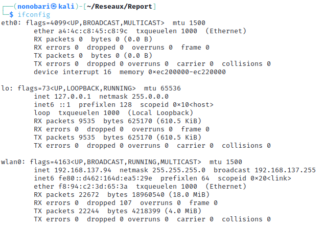

Rapport
\
Introduction à la cybersécurité
==============

Auteurs: BACKERT Noé, BANCHET Antoine, BARA Yassmina

# Table des matières
1. [Introduction](#introduction)
2. [Footprint](#footprint)
3. [Scanning Networks](#scanning-networks)

# Introduction

Ce rapport est écrit dans un but d'introduction à la sécurité dans le cadre des cours d'ingénieur à l'école des Mines de Saint-Etienne.
On s'intéressera alors au Phishing, au scan de réseaux et des ports ouverts sur différentes machines, ainsi qu'aux scans de leurs vulnérabilitées.
On s'occupera dans un second temps de proposer des solutions à ces vulnérabilitées. 
Pour les parties 2,3 et 4, nous allons utiliser le réseau privé suivant fabriqué à l'aide d'un réseau privé fait par l'ordinateur fixe de Noé:

 

# Reconnaissance/Footprint
## 1. OSINT

La première phase d'une attaque est la phase de reconnaissance. Le but est d'obtenir le plus d'information possible sur notre victime.

On doit toujours déterminer le scope de l'attaque et avoir la permission de l'entreprise ou du particulier avant de commencer.

Que ce soit pour récuperer des informations sur une entreprise ou sur une personne, on peut utiliser dans un premier temps les moteurs de recherche classiques comme Google, Bing, Yahoo, DuckDuckGo,... On peut utilser les google dorks pour trouver des informations plus précises. 
Le google dorking consiste à utiliser des opérateurs de recherche avancés dans les moteurs de recherche pour trouver des informations sensibles et cachées sur des sites web. 
Exploit db regroupe beaucoup de google dorks: https://www.exploit-db.com/google-hacking-database.

Il peut aussi être trés interessant de visiter des sites web archiver avec archive.org ou waybackmachine.org. Ces sites permettent de voir les anciennes versions d'un site web. On peut ainsi voir les anciennes versions d'un site web et récupérer des informations qui ont été supprimées.

Des outils github tels que [Holehe](https://github.com/megadose/holehe/) ou [Sherlock](https://github.com/sherlock-project/sherlock) permettent de rechercher des pseudos sur les réseaux sociaux. Ils permettent de trouver des informations sur une personne en recherchant son pseudo sur les réseaux sociaux.

Sherlock permet de rechercher un pseudos sur des centaines de réseaux sociaux.

Holehe est un outil qui permet de vérifier si une adresse email est associée à un compte sur différents sites tels que Twitter, Instagram, Imgur et plus de 120 autres plateformes. Il s'agit d'un outil de recherche d'informations qui peut être utilisé pour identifier les comptes enregistrés liés à une adresse email spécifique. Cet outil est implémenter dans notre framework.

Les sites webes contiennent aussi des documents très intéressants (pdf, excel etc ) qui peut être intéressant de récuper avec metagoofil. Metagoofil est un outil qui permet de récupérer des informations sur un site web (ex: les adresses mail des personnes qui ont travaillé sur le site, les documents pdf, les images, ...) et de les télécharger.

Ensuite, il faut receuillir des informations plus techniques. On s'interesse au nom de domaine avec l'outil WHOIS qui permet d'obtenir beauocup d'information sur celui-ci.
De même TheHarvester va aller chercher les sous domaines d'un site web, les emails adresses liés à celui ci, etc..
Whois et TheHarvester sont implémentés dans notre framework.

On peut aussi utiliser traceroute pour voir le chemin d'un paquet vers le domaine entré.
    traceroute raphaelviera.fr

traceroute - affiche le chemin d'un paquet vers le domaine entré

Le but est vraiment d'obtenir le plus d'informations possible et de comprendre la strcuture du site web a attaquer ou de l'entreprise ou de la cible.
Il s'agit ensuite de réaliser du social engineering très ciblé grâce aux informations récoltées.

Le social engineering est une technique qui consiste à manipuler les gens pour qu'ils donnent des informations sensibles ou qu'ils effectuent des actions qui peuvent être préjudiciables pour eux ou pour leur entreprise.
On peut se faire passer pour un membre de l'entreprise, réussir à rentrer dans l'entreprise et récupérer des informations sensibles, ou encore se faire passer pour un membre de la famille de la cible et récupérer des informations sensibles. Il existe de nombreuses techniques de social engineering. 
Il faut retenir que plus on connait la cicble, plus on est susceptible de réussir.

## 2. Social Enginnering/Phishing 

<u>Report on social engineering: Phising made by Antoine Banchet</u>

## Introduction

Cette section est individuelle et a pour but de présenter le phishing et ses différentes formes.

La cible durant cette section est Noé Backert, dont j'ai obtenu son autorisation préalable.
## I. Phishing

Le phishing est une forme de cyberattaque qui peut être utilisée pour voler des données sensibles, notamment des informations de connexion et des détails de carte de crédit. Il se produit lorsqu'un attaquant, se faisant passer pour une entité de confiance, vous incite à cliquer sur un lien ou à ouvrir une pièce jointe dans un courrier électronique ou un message. Cela peut également se produire via un appel téléphonique ou un message texte. Les attaques de phishing peuvent être utilisées pour voler des informations personnelles, telles que des noms d'utilisateur, des mots de passe et des détails de carte de crédit, ou pour distribuer des logiciels malveillants.

## II. Méthodologie

Généralement, le phishing se déroule en plusieurs étapes :

1. L'attaquant doit d'abord choisir sa cible et obtenir des informations sur elle. Cela peut se faire, par exemple, en utilisant les réseaux sociaux ou en utilisant des techniques de social engineering pour obtenir des informations sur la cible (OSINT).

2. L'attaquant doit ensuite choisir la forme de phishing qu'il va utiliser. Il peut s'agir d'un e-mail, d'un message texte, d'un appel téléphonique, d'un message sur les réseaux sociaux, etc.

3. L'attaquant doit ensuite créer le message de phishing. Celui-ci doit être crédible et inciter la cible à effectuer une action, comme cliquer sur un lien ou ouvrir une pièce jointe.

4. L'attaquant doit ensuite envoyer le message de phishing à la cible. Une fois que la cible a effectué l'action demandée, l'attaquant peut alors obtenir les informations qu'il souhaite. La plupart du temps, le lien de phishing renvoie vers une fausse page de connexion qui enregistre les identifiants de la cible, installe un logiciel malveillant sur la machine ou enregistre les informations de carte bancaire.

### III. Cas pratique

Le cas pratique le plus courant consiste à créer un mail de phishing. Pour cela, on peut utiliser des outils tels que [GoPhish](https://getgophish.com/), qui permettent de créer des mails de phishing et de suivre les personnes qui ont cliqué sur le lien ou ouvert la pièce jointe. Cet outil est principalement utilisé pour mener des campagnes de phishing. On peut également utiliser Social Engineering Toolkit (SET) pour cibler une personne spécifique. Cet outil permet de créer directement un mail de phishing et de l'envoyer à la cible. Il est également possible de cloner directement un site.

Cependant, j'ai décidé d'utiliser une technique appelée "Rogue Wi-Fi Access Point Attack" en utilisant le framework "Wifipumpkin3". Ce framework permet de créer un point d'accès Wi-Fi et de cloner un site. Ainsi, lorsque la cible se connecte au point d'accès, elle est redirigée vers le site cloné. On peut alors récupérer les identifiants de la cible. Vous pouvez trouver le framework "Wifipumpkin3" sur GitHub à l'adresse suivante : [https://github.com/P0cL4bs/wifipumpkin3](https://github.com/P0cL4bs/wifipumpkin3).

### IV. Explication de la méthode utilisée

Sur le réseau de notre résidence étudiante, après s'être connecté au réseau Wi-Fi, nous devons nous identifier avec nos identifiants étudiants pour pouvoir accéder à Internet. Ainsi, j'ai décidé de créer un point d'accès Wi-Fi avec le même nom que le réseau Wi-Fi de la résidence étudiante et de cloner la page de connexion. Ainsi, lorsque la cible se connecte au point d'accès, elle est redirigée vers la page de connexion clonée.

Pour cela, j'ai utilisé le framework "Wifipumpkin3". Ce framework permet de créer un point d'accès Wi-Fi et de cloner un site.

Voici la page de connexion du réseau Wi-Fi de la résidence étudiante :

1. Le framework wifipumpkit3 ressemble à cela:

1. Il faut dans un premier temps configurer le point d'accès wifi (ap):

On voit que le ap est configuré avec le nom du réseau Wi-Fi de la résidence étudiante, et que le mode de sécurité est WPA2. J'aurais aussi pu mettre le même mot de passe mais je dois hacker uniquement noé et pas toute la résidence 😅.

1. Ensuite, il faut configurer le module de clonage de site (web-cloner). J'ai pour cela utilisé goclone : https://github.com/imthaghost/goclone
2. On active ensuite le portail de connexion sur wifipumpkin3, activant la page de connexion de la résidence étudiante. Ici emse_v2.
J'ai pour cela suivis le tutoriel suivant: https://wifipumpkin3.github.io/docs/getting-started#development

1. Enfin, on lance le point d'accès Wi-Fi, et on attend que la cible se connecte.

On voit l'adresse MAC de la cible connexté au point d'accès Wi-Fi, ici Noé. Un serveur DHCP et DNS est aussi lancé, permettant de rediriger la cible vers la page de connexion clonée. On voit que c'est l'ordinateur de Noé DESKTOP-1BGVP3K.
1. Lorsque la cible se connecte, elle est redirigée vers la page de connexion clonée. On peut alors récupérer les identifiants de la cible. Ici noe.backert et le mot de passe: test.

Remarque :
On pourrait déconnecter de manière répétée les utilisateurs du réseau Wi-Fi en envoyant en boucle des paquets de déauthentification, ce qui rendrait la connexion au vrai Wi-Fi impossible. Cela forcerait ainsi les utilisateurs à se connecter au faux Wi-Fi. Wifipumpkin3 permet de réaliser cette action.

On peut utiliser aireplay-ng pour le faire aussi:
https://www.inkyvoxel.com/wi-fi-deauthentication-attacks-using-aireplay-ng/

### V. Du point de vue de la victime

1. Noé se connecte au réseau Wi-Fi de la résidence étudiante. 
2. Il voit que le réseau est bien celui de la résidence étudiante, et qu'il est sécurisé. Il se connecte donc au réseau Wi-Fi.

3. Il est redirigé vers la page de connexion de la résidence étudiante. Il rentre alors ses identifiants.

4. il navigue ensuite sur Internet normalement sans rien remarquer. J'ai en plus accès à tout ce qu'il consulte et qui est visible en clair.
   
### VI. Conclusion
Pour conclure, l'attaque n'est pas encore parfaite car on voit que l'Url de la fausse page de connexion affiche 10.0.0.1 qui est l'adresse du routeur et non pas l'adresse de la page de connexion de la résidence étudiante. Il faudrait donc trouver un moyen de changer l'Url de la page de connexion. En configurant le DNS du point d'accès on pourrait peut être y arriver.

Cette attaque est très simple à mettre en place et peut être très efficace. Il est donc important de faire attention aux réseaux Wi-Fi auxquels on se connecte (ex: réseaux publics) et de vérifier que l'adresse de la page de connexion est bien celle du site officiel.

## 3. Countermeasures against phishing
Pour se protéger du phishing, il est recommandé de faire preuve de prudence et de vigilance. Il est important d'être conscient des risques liés aux communications non sollicitées, telles que les emails, les messages ou les appels téléphoniques, qui peuvent chercher à obtenir des informations personnelles ou financières. Il est conseillé de vérifier attentivement l'identité de l'expéditeur en confirmant l'adresse email ou le numéro de téléphone utilisé. Il est également préférable de ne pas cliquer sur des liens suspects, qui peuvent potentiellement rediriger vers des sites web frauduleux. Pour assurer une protection adéquate, il est recommandé de ne partager des informations sensibles que lorsque l'on est certain de la légitimité de la demande. L'activation de l'authentification à deux facteurs lorsqu'elle est disponible et la mise à jour régulière des logiciels utilisés sont des mesures supplémentaires pour renforcer la sécurité en ligne. Enfin, il est bénéfique de se familiariser avec les différentes techniques de phishing afin d'être mieux préparé à les reconnaître et de partager ces connaissances avec d'autres pour les sensibiliser à ces risques potentiels.

# Scanning networks
## 1. Network scan
Le "network scan" consiste à explorer et à analyser les hôtes, les ports ouverts et les services disponibles sur le réseau afin d'identifier d'éventuelles vulnérabilités et faiblesses de sécurité.

L'objectif principal du "network scan" est de cartographier le réseau, c'est-à-dire de découvrir les hôtes actifs, d'identifier les systèmes, les adresses IP et les services qui sont accessibles depuis l'extérieur. Cela nous permet d'évaluer la surface d'attaque potentielle et de cibler les efforts sur les zones les plus sensibles.

En effectuant un "network scan", nous pouvons détecter les ports ouverts, les services mal configurés, les versions de logiciels obsolètes et les éventuelles vulnérabilités connues. Ces informations sont ensuite utilisées pour planifier et exécuter des tests de sécurité plus approfondis, tels que des scans de vulnérabilités ou des attaques ciblées.

<u>Méthodologie</u>
On commence par chercher notre addresse IP à l'aide de la commande : 

    ifconfig

Pour effectuer un scan basique d'un réseau, on peut utiliser la commande suivante : 

    fping -s -g 192.168.137.0 192.168.137.254

Celle-ci nous permet d'envoyer une requête et d'attendre un retour sur l'ensemble des adresses IP du sous-réseau indiqué.

Ainsi, nous savons que 3 appareils sont connectés au réseau.

On peut donc augmenter la taille des paquets jusqu'à obtenir une erreur de timeout en utilisant la commande suivante :

    ping -s <packet_size> 192.168.137.68

En tâtonnant, on observe qu'il y a une erreur en envoyant un paquet au dessus de 65507 bytes. Le buffer ne doit pas accepter autant. 

Autrement, on peut vérifier cela à l'aide du script python suivant :

    import os
    import sys

    if len(sys.argv)<=1:
        print("Error : Arg missing, ip required")
    else: 
        ip = sys.argv[1]
        for size in range(0,80000,8):
            os.system(f"ping -s {size} -c 1 {ip}")

Celui-ci teste un ping vers l'adresse ip mis en argument lors du lancement du script en augmantant à chaque fois d'un octet, jusqu'à qu'une erreur intervienne.

On obtient alors bien une erreur vers la taille trouvée en tâtonnant :

>

Autrement, on peut tout simplement effectuer un nmap sur l'ensemble du sous-réseau :

La commande suivante nous permet d'envoyer une requête de ping à toutes les addresses IP du réseau (en utilisant le masque de sous-réseau 255.255.255.0)

    nmap 192.168.137.0/24 -sP

Cela nous permet ainsi de voir quels addresses IP sont utilisées, cependant, on ne peut pas deviner l'identité de cette machine en utilisant seulement cette commande.

---

Pour faire cela nous utilisons principalement nmap ce qui est la norme. 
On peut aussi utiliser des outils plus automatisés comme netdiscover ou encore graphique comme nessus.

## 2. Port scan
Le "port scan" consiste à analyser les ports d'un hôte ou d'un réseau pour déterminer quels ports sont ouverts, fermés ou filtrés. 

Chaque service réseau s'exécute généralement sur un port spécifique, par exemple, le service Web HTTP sur le port 80 ou le service de messagerie SMTP sur le port 25. En effectuant un "port scan", nous pouvons identifier les services qui sont accessibles depuis l'extérieur et les ports ouverts sur lesquels ces services sont en cours d'exécution.

Le "port scan" peut être utilisé pour différentes raisons. Tout d'abord, il permet de cartographier les ports ouverts sur un système, ce qui donne une idée de la surface d'attaque potentielle et permet de détecter d'éventuelles vulnérabilités ou faiblesses de configuration. En identifiant les services actifs et les versions logicielles, nous peuvons rechercher des vulnérabilités connues associées à ces services et prendre des mesures pour les corriger.

De plus, le "port scan" peut être utilisé pour évaluer les politiques de filtrage des pare-feu. En analysant les réponses des ports, les testeurs peuvent déterminer quels ports sont bloqués ou filtrés, ce qui permet de mieux comprendre la défense en place et de détecter d'éventuelles erreurs de configuration.

Pour faire cela nous utilisons principalement nmap ce qui est la norme. 

Cette commande nous permet de trouver tous les ports ouverts et également de trouver des informations supplémentaires sur la machine, comme son addresse MAC.

    sudo nmap 192.168.137.68

Cette commande requiert l'accès root.

## 3. Vulnerabily scan

La phase de scan de vulnérabilité est une étape cruciale car elle permet d'identifier les vulnérabilités potentielles présentes dans les systèmes, les applications ou les infrastructures testées. Cela implique l'utilisation d'outils et de techniques spécifiques pour analyser et évaluer la sécurité des cibles.
Durant le cours, nous utilisons une machine virtuelle VISMIN qui présente des failles de sécuritées.
Il faut dans l'ordre:

1. Identification des vulnérabilités : Le scan de vulnérabilité permet de découvrir les faiblesses de sécurité potentielles dans les systèmes ciblés. Cela inclut les vulnérabilités connues, les configurations incorrectes, les versions obsolètes de logiciels, les paramètres de sécurité faibles, etc. En identifiant ces vulnérabilités, nous pouvons évaluer le niveau de risque associé et recommander des mesures correctives pour les atténuer.

2. Priorisation des actions : Le scan de vulnérabilité fournit des informations quantitatives et qualitatives sur les vulnérabilités détectées. Cela permet de classer les vulnérabilités en fonction de leur criticité et de leur impact potentiel sur la sécurité. Cette priorisation aide les organisations à se concentrer sur les vulnérabilités les plus importantes, en leur permettant de hiérarchiser les efforts de remédiation et d'atténuation.

3. Conformité aux normes : Le scan de vulnérabilité peut aider les organisations à se conformer à des normes et des réglementations de sécurité spécifiques. En identifiant et en remédiant aux vulnérabilités, les entreprises peuvent répondre aux exigences de conformité et démontrer leurs efforts pour protéger les données sensibles et maintenir un niveau de sécurité adéquat.
Il faut pour chaque vulnérabilitées se référencer à sa catégorie OWASP.
OWASP (Open Web Application Security Project) est une communauté mondiale dédiée à l'amélioration de la sécurité des applications web à travers l'éducation, la sensibilisation et le développement de bonnes pratiques.

4. Sensibilisation à la sécurité : La phase de scan de vulnérabilité permet de sensibiliser les parties prenantes à l'importance de la sécurité des systèmes et des données. Les rapports de scan mettent en évidence les risques et les vulnérabilités spécifiques, fournissant des preuves tangibles des faiblesses existantes. Cela peut aider à justifier les investissements en matière de sécurité et à promouvoir une culture de la sécurité au sein de l'organisation.

En résumé, la phase de scan de vulnérabilité dans un pentest est essentielle pour découvrir, évaluer et hiérarchiser les vulnérabilités présentes dans les systèmes testés. Cela permet de prendre des mesures appropriées pour renforcer la sécurité et réduire les risques potentiels pour les systèmes et les données sensibles.

Remarque: Cette liste d'action provient d'une documentation utilisé pendant le stage de premier année d'Antoine Banchet dans une entreprise de cybersécurité, ITS EUGENA.

<u>Méthodologie</u>

Pour réaliser un scan de vulnérabilité:
1. Il faut trouver l'IP de la machine a scanner, voir [Network_Scan](## 1. Network scan).
2. Il faut ensuite lister les ports avec nmap, voir [Port_Scan](## 2. Port scan)
3. Ensuite on peut soit chercher des vulnérabilitées à la main ou avec des scripts nmap par exemple. Cependant utiliser des outils
automatisés tels que Nessus ou OpenVAS facilite beaucoup la chose.

## 4. Patching the Vulnerabily

Lorsqu'on découvre des vulnérabilités lors de la phase de scan de vulnérabilité, il est essentiel de suivre un processus structuré pour leur gestion :

1. Documentation : Les vulnérabilités doivent être soigneusement documentées, en fournissant des détails précis tels que la description, l'emplacement, l'impact potentiel et les preuves de l'existence de la vulnérabilité. Cela permet de partager des informations claires avec les parties prenantes concernées.

2. Évaluation de l'impact : Il est important d'évaluer l'impact réel des vulnérabilités identifiées. Cela implique de comprendre comment elles pourraient être exploitées et les conséquences potentielles en termes de sécurité et d'intégrité des données.

3. Priorisation : Les vulnérabilités doivent être classées en fonction de leur criticité, de leur exploitabilité et de leur impact potentiel. Cela permet de déterminer quelles vulnérabilités doivent être traitées en premier en fonction des risques qu'elles représentent pour le système ou l'application.

4. Recommandations de correction : Il faut fournir des recommandations claires et précises pour corriger les vulnérabilités identifiées. Cela peut inclure des correctifs de configuration, des mises à jour de logiciels, des changements dans les pratiques de développement ou d'autres mesures de sécurité appropriées.

5. Rapport : Les résultats de l'analyse des vulnérabilités doivent être communiqués aux parties prenantes concernées, généralement sous forme de rapport détaillé. Ce rapport doit inclure une description des vulnérabilités, leur impact potentiel, les recommandations de correction et, si possible, des captures d'écran ou des preuves supplémentaires.

6. Suivi et vérification : Une fois les vulnérabilités corrigées, il est important de vérifier leur résolution effective. Les pentesters peuvent effectuer des tests supplémentaires pour confirmer que les vulnérabilités ont été traitées correctement et que le système ou l'application est désormais sécurisé.

Il est essentiel de noter que tout le processus de traitement des vulnérabilités doit être effectué en collaboration étroite avec les parties prenantes et en respectant les politiques et les procédures internes de l'organisation.

Remarque: Cette liste d'action provient d'une documentation utilisé pendant le stage de premier année d'Antoine Banchet dans une entreprise de cybersécurité, ITS EUGENA.

# Enumeration
En plus de simplement rechercher les vulnérabilités d'une machine, on peut chercher à les exploiter.
Pour cela, nous devons obtenir des informations sur les services de la machine.
On va mettre en place du "Banner Grabbing", qui consiste à extraire les bannières de services réseau pour obtenir des informations sur les versions logicielles et les configurations. Mais aussi de l'énumération d'OS (système d'exploitation) pour déterminer le système d'exploitation utilisé par la cible, ce qui peut aider à identifier les vulnérabilités spécifiques à ce système. L'énumération des utilisateurs implique la recherche d'informations sur les utilisateurs valides du système, tels que les noms d'utilisateur, les comptes actifs, les groupes d'utilisateurs, etc. 
Dans l'ensemble, la phase d'énumération permet d'obtenir des informations précieuses sur la cible, ce qui facilite l'élaboration de stratégies d'attaque plus ciblées et aide à identifier les faiblesses potentielles à exploiter.

## 1. Banner Grabbing

On va chercher à extraitre les bannières des services de la machine.
- Banner grabbing using TELNET
- Banner grabbing using NetCat
- Banner grabbing using NMAP
- Banner grabbing using Metasploit framework
-  Operating System detection using NMAP

