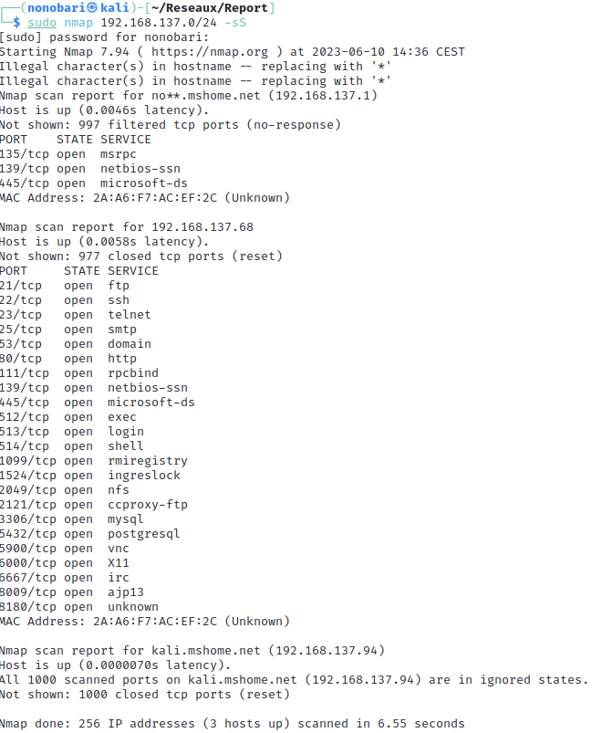

# Report: Introduction to cybersecurity

## Introduction

Ce rapport est écrit dans un but d'introduction à la sécurité dans le cadre des cours d'ingénieur à l'école des Mines de Saint-Etienne.
On s'intéressera alors au Phishing, au scan de réseaux et des ports ouverts sur différentes machines, ainsi qu'aux scans de leurs vulnérabilitées.
On s'occupera dans un second temps de proposer des solutions à ces vulnérabilitées. 
Pour les parties 2,3 et 4, nous allons utiliser le réseau privé suivant fabriqué à l'aide d'un réseau privé fait par l'ordinateur fixe de Noé:

 

## I. Footprint
1. Phishing : Information about the target, how they were obtained etc.
2. Phishing by e-mail: Example of an email to be sent to the target
3. Countermeasures against phishing

## II. Scanning networks
1. Network scan

La commande suivante nous permet d'envoyer une requête de ping à toutes les addresses IP du réseau (en utilisant le masque de sous-réseau 255.255.255.0)

    nmap 192.168.137.0/24 -sP

Cela nous permet ainsi de voir quels addresses IP sont utilisées, cependant, on ne peut pas deviner l'identité de cette machine en utilisant seulement cette commande.

2. Port scan

Cette commande nous permet de trouver tous les ports ouverts et également de trouver des informations supplémentaires sur la machine, comme son addresse MAC.

3. Vulnerabily scan
4. Patching the Vulnerabily