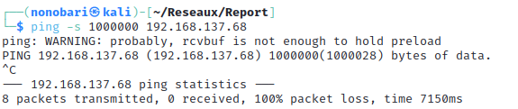

Rapport
\
Introduction à la cybersécurité
==============

# Table des matières
1. [Introduction](#introduction)
2. [Footprint](#footprint)
3. [Scanning Networks](#scanning-networks)

# Introduction

Ce rapport est écrit dans un but d'introduction à la sécurité dans le cadre des cours d'ingénieur à l'école des Mines de Saint-Etienne.
On s'intéressera alors au Phishing, au scan de réseaux et des ports ouverts sur différentes machines, ainsi qu'aux scans de leurs vulnérabilitées.
On s'occupera dans un second temps de proposer des solutions à ces vulnérabilitées. 
Pour les parties 2,3 et 4, nous allons utiliser le réseau privé suivant fabriqué à l'aide d'un réseau privé fait par l'ordinateur fixe de Noé:

 

# Footprint
## 1. Phishing : Information about the target, how they were obtained etc.
## 2. Phishing by e-mail: Example of an email to be sent to the target
## 3. Countermeasures against phishing

# Scanning networks
## 1. Network scan

On commence par chercher notre addresse IP à l'aide de la commande : 

    ifconfig

Pour effectuer un scan basique d'un réseau, on peut utiliser la commande suivante : 

    fping -s -g 192.168.137.0 192.168.137.254

Celle-ci nous permet d'envoyer une requête et d'attendre un retour sur l'ensemble des adresses IP du sous-réseau indiqué.

Ainsi, nous savons que 3 appareils sont connectés au réseau.

On peut donc augmenter la taille des paquets jusqu'à obtenir une erreur de timeout en utilisant la commande suivante :

    ping -s <packet_size> 192.168.137.68

En tâtonnant, on observe qu'il y a une erreur en envoyant un paquet au dessus de 65507 bytes. Le buffer ne doit pas accepter autant. 

---
\
\
\

La commande suivante nous permet d'envoyer une requête de ping à toutes les addresses IP du réseau (en utilisant le masque de sous-réseau 255.255.255.0)

    nmap 192.168.137.0/24 -sP

Cela nous permet ainsi de voir quels addresses IP sont utilisées, cependant, on ne peut pas deviner l'identité de cette machine en utilisant seulement cette commande.

2. Port scan

Cette commande nous permet de trouver tous les ports ouverts et également de trouver des informations supplémentaires sur la machine, comme son addresse MAC.

Cette commande requiert l'accès root avec la commande sudo

    sudo nmap 192.168.137.0/24 -sS

3. Vulnerabily scan

4. Patching the Vulnerabily